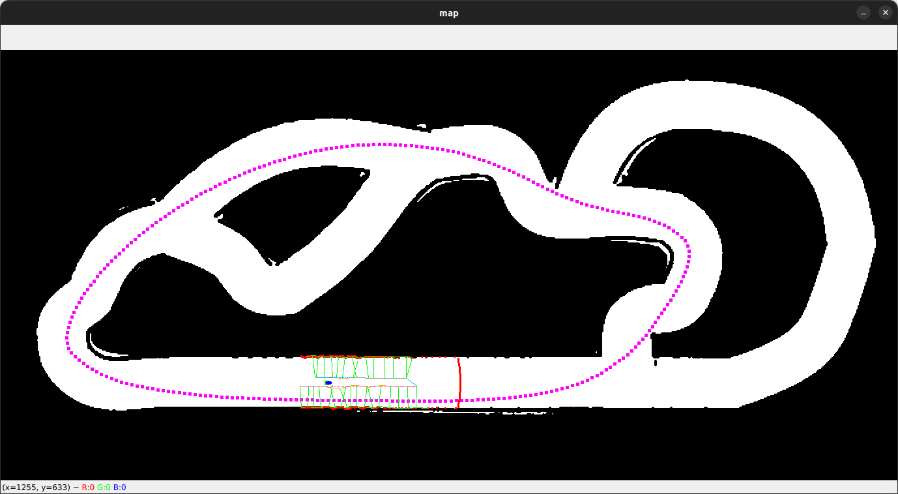
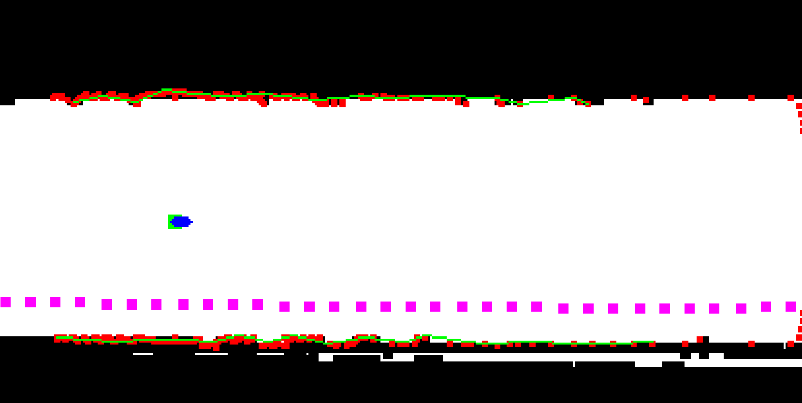
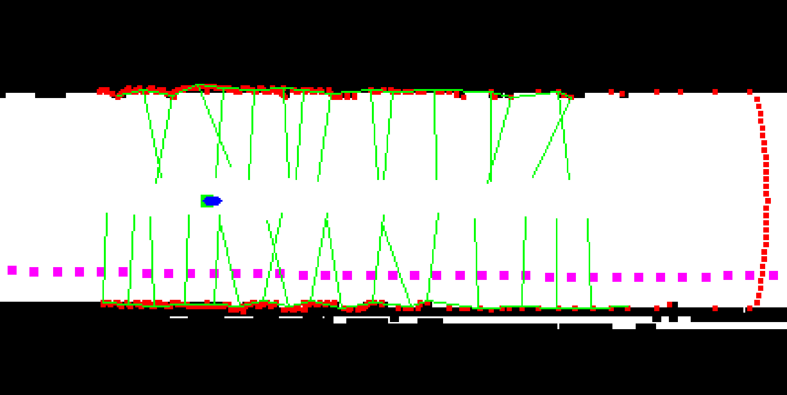
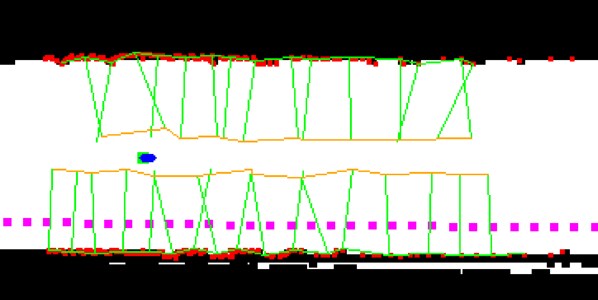
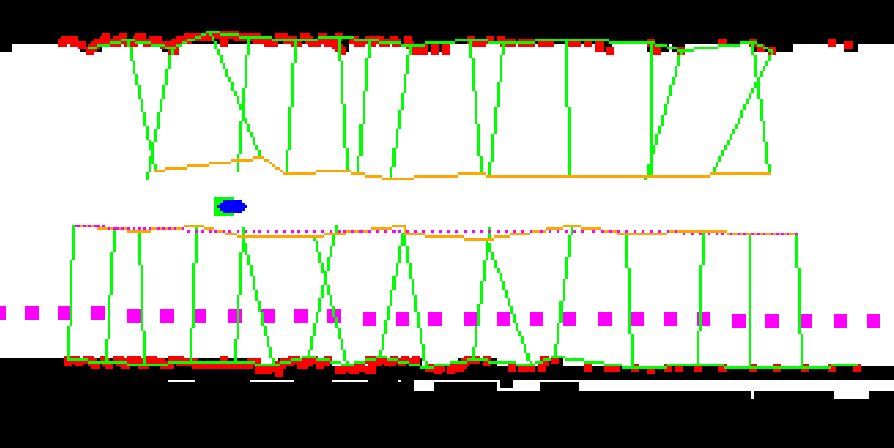
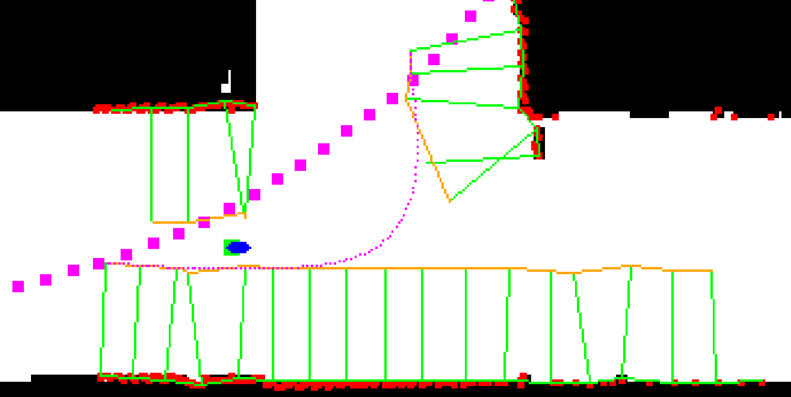
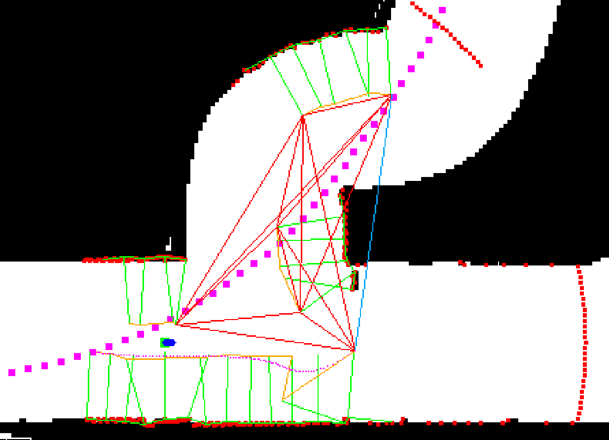
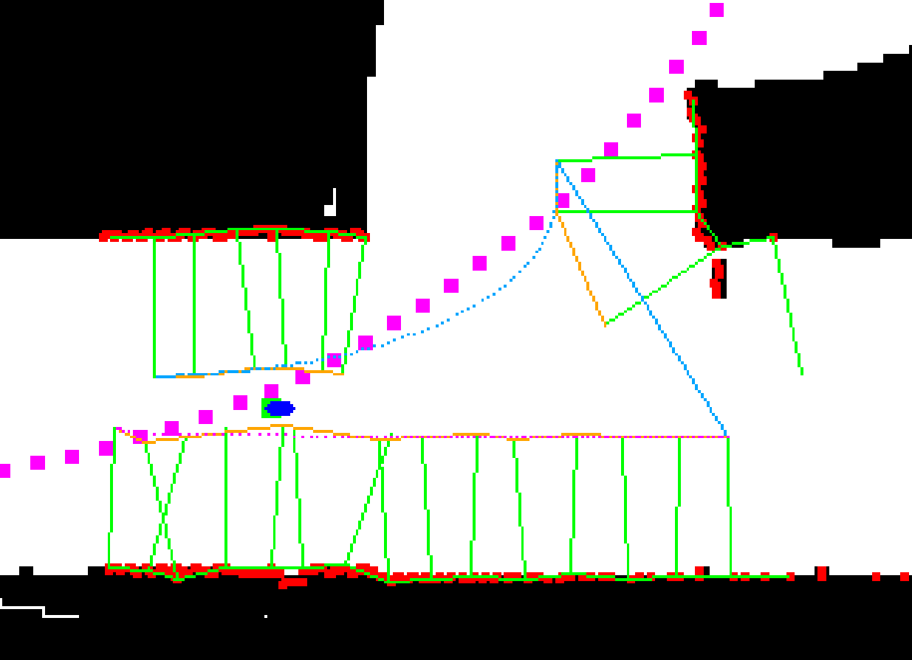
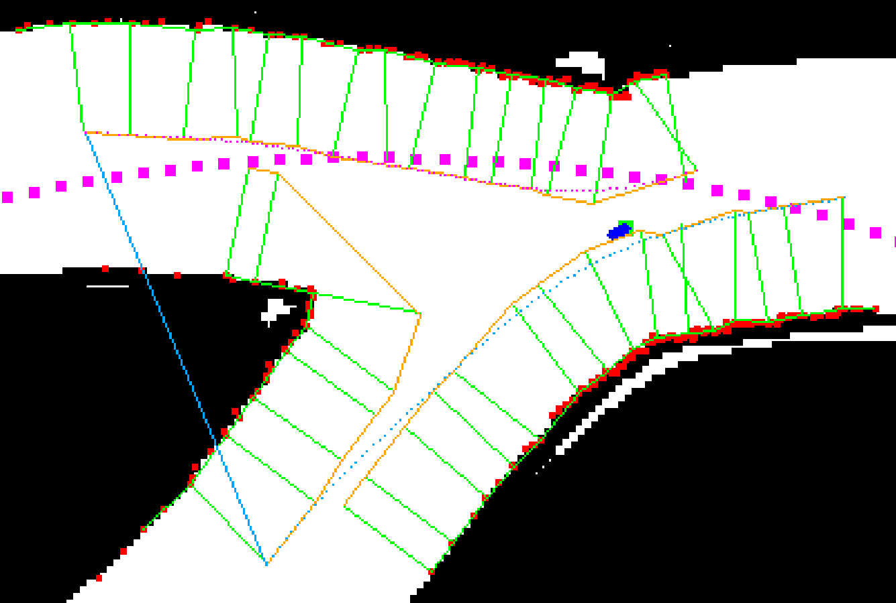

# Lidar Trajectory Planner

This is repository with my solution for planning trajectory for f1teenth bolid with lidar data. This is very simplified environment. Only for testing concepts and visualization.

Maps and datapath are taken from [Autoware](https://github.com/autowarefoundation/autoware)

## Running the demo

Simply run

```bash
python3 main.py
```

The window should pop up



Now you can control the bolid (green square with blue arrow) with:
- w - move forward
- a/d - turn left/right
- s - move backwards

Big pink dots are representing the reference trajectory, red dots are lidar points. Two trajectories are planned:
- small blue dots - on intersections always turn left
- small pink dots - on intersections always turn right

## Algorithm

Connect all lidar points together. If the distance between consecutive points is larger then the thresholdand, divide the line into sections. Then reduce number of points in each section.



Find normal vectors to the points.



Connect the ends of normal vecotrs together.



Use bezier curve to smooth obtained path.



Add the ability to propoerly join two path sections. This is done by finding two closest points on both paths and connecting them together. At the same time rest of the points is ignored.



Next step is to recognize the intersections. To achieve that, every start and end point from each subsection is connected with each other. Then the triangle with biggest perimeter is found.



Left corner of this triangle is showing the path to the left, and right corner to the right. Here we can see two examples of trajectories planned on intersections.



